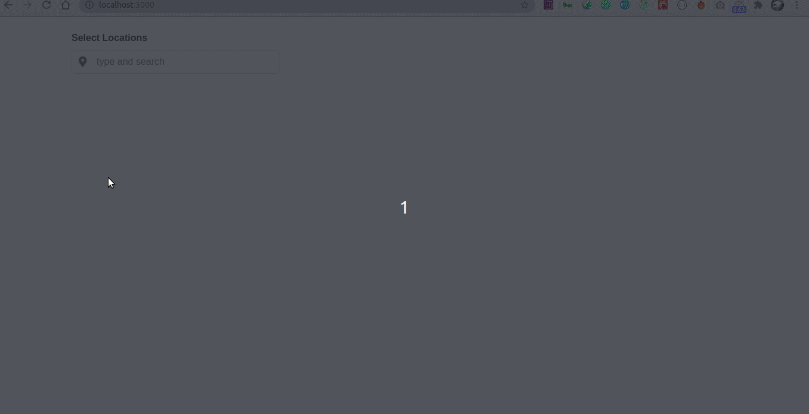
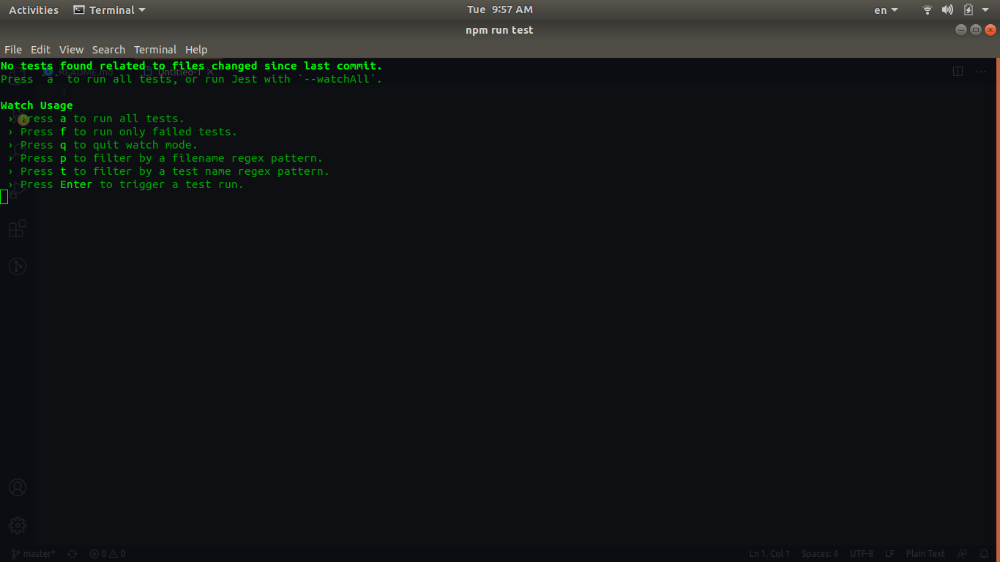
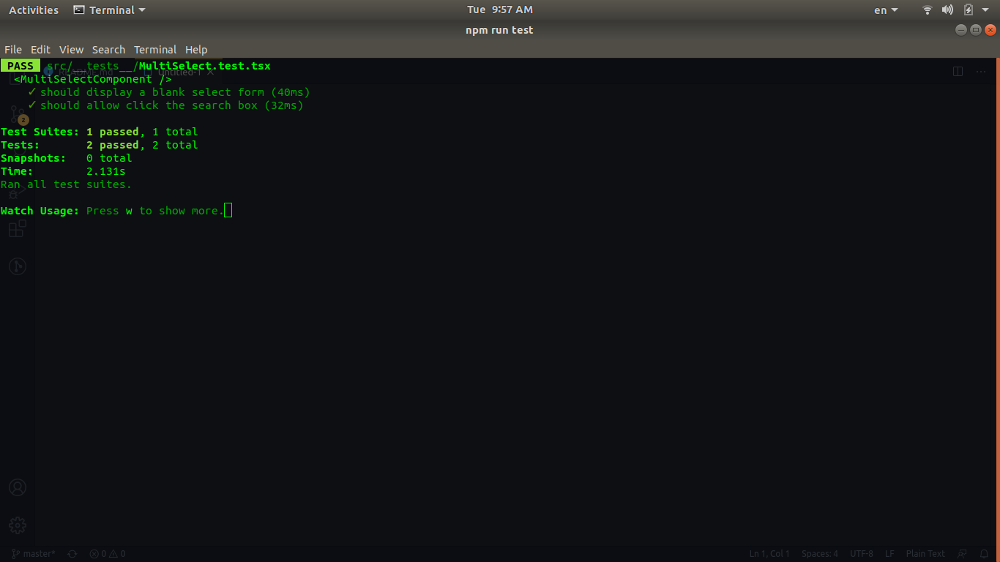

# react-multi-select-search
Simple and lightweight multiple selection search component. The example is about to search and select multiple locations.

[](https://github.com/facebook/react)
[](https://github.com/fatematzuhora/react-multi-select-search.git)

API is sourced from [meteoblue](https://www.meteoblue.com).

### Screen Record


### Quick Start
* Clone the repo:
```
git clone https://github.com/fatematzuhora/react-multi-select-search.git
```
* Go inside the folder:
```
cd react-multi-select-search
```
* Install necessary libraries:
```
npm i
```
* Create an environment file:
```
touch .env
```
* Open environment file and edit configuration variables:

#### Sample .env file
```
# .env file
NODE_PATH=./src
ROOT_DIR=./

# environment variables
REACT_APP_NODE_ENV="dev"
REACT_APP_API_BASE_URL=https://www.meteoblue.com
```
* Run Project:
```
npm start
```

### Test the Component
* Run the following command:
```
npm run test
```


* Now press **a** to run all the tests:



### Disclaimer
This simple web component massages and displays based on curated datasets from `meteoblue` and does not attempt to produce or collect any beyond those sources. The datasets come with their own sets of "Terms and Conditions".